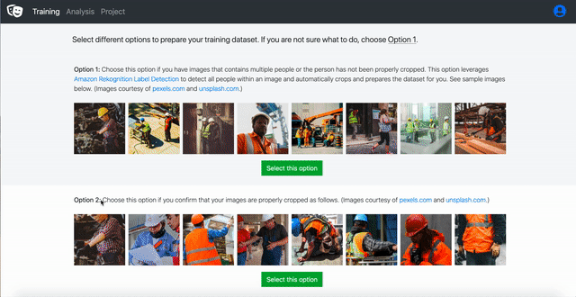
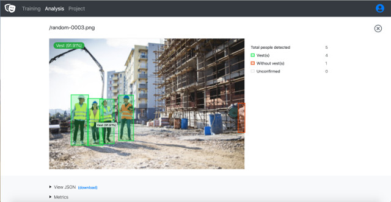
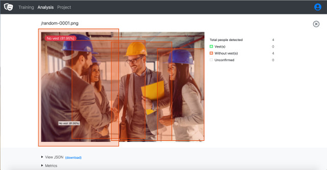
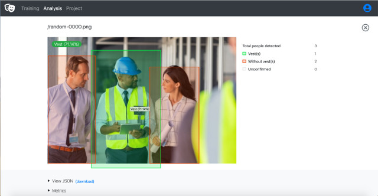
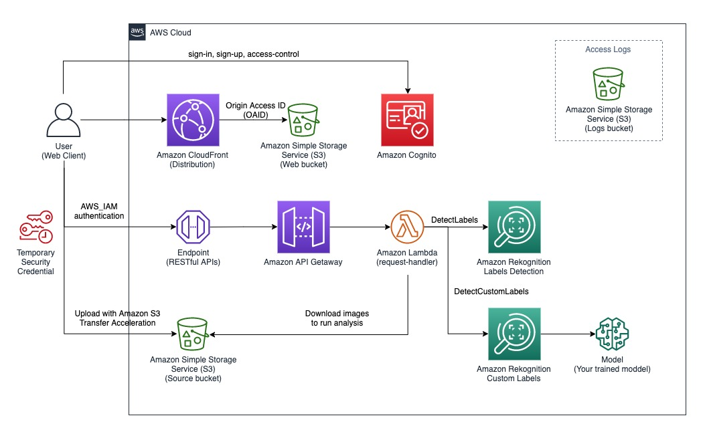
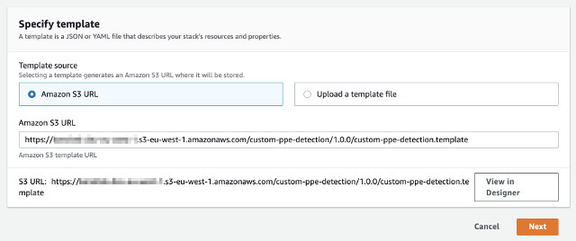
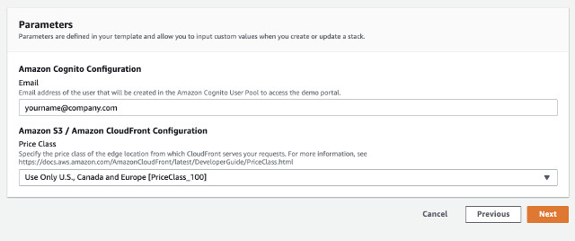
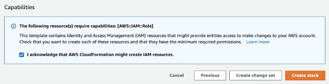

# Amazon Rekognition Custom PPE Detection Demo Using Custom Labels

If you are looking for pre-trained Personal Protective Equipment (PPE) detection APIs, please visit our[Amazon Rekognition PPE](https://aws.amazon.com/rekognition/) APIs.

This demo solution demonstrates how to train a custom model to detect a specific PPE requirement, **High Visibility Safety Vest**. It uses a combination of [Amazon Rekognition Labels Detection](https://docs.aws.amazon.com/rekognition/latest/dg/labels.html) and [Amazon Rekognition Custom Labels](https://aws.amazon.com/rekognition/custom-labels-features/) to prepare and train a model to identify an individual who is wearing a vest or not.

It consists of two main workflows: **Training** and **Analysis**. The former helps you to prepare dataset, train and run a Custom Labels model; the latter provides an easy way to analyze images using the model. The solution also provides a simple web interface to guide you through both training and analysis processes.

__

## Training Workflow

The Training workflow provides an easy way to prepare dataset, create, and train your own Custom Labels model. The Custom Labels model uses [Image-level Labels](https://docs.aws.amazon.com/rekognition/latest/customlabels-dg/rv-assign-labels.html) where we assign an image (a person in our case) to either a **vest** or **novest** label to indicate a person is wearing a _Safety vest_ or not.

The web interface exposes _two_ options to prepare and train your first Custom Label model.

__

### Option 1: Prepare and train with unstructured images

This option allows you drag and drop images that have not been categorized/labeled; for instance, an image with a large crowd. This option first uses Amazon Rekognition Labels Detection to obtain bounding boxes of each person's coordinate and to crop the person within the image.  Then it prepares the dataset (cropped images) for you to label. The animated GIF below demonstrates the steps to prepare the training dataset. Once the preparation is done, use Option 2 (described below) to upload and train a Custom Labels model.


__

### Option 2: Prepare and train Custom Labels with structured/labeled images
If you have already prepared your training dataset (people already cropped and labeled), choose this option to upload your training dataset by drag and drop images where people wear **vest** to the **vest area** and people who don't wear vest to the **novest area**. Then, create and train a Custom Labels model. The animated GIF below demonstrates the steps.



__

## Analysis Workflow
Once the Custom Labels model is trained and is running, you can start analyzing image(s) by dropping images into the web portal. The analysis process is designed to run concurrently; thus, you can drop one image or a collection of images at once. See the animated GIF below:


__

## Examples of detection results
A few examples of the detection results are shown below:



*(Green box highlights individual who is wearing a high visibility vest with a confidence score)*



*(Red box highlights individual who is not wearing a high visibility vest)*



*(Shows detection result in a mixed group)*

___

# Architecture overview

The solution is designed with [serverless architecture](https://aws.amazon.com/serverless/). The architectural diagram below illustrates an overview of the solution.



User first signs in to the web portal using Amazon Cognito service. The web application is hosted on an Amazon Simple Storage Service (S3), a **web bucket** indicated in the diagram. The web bucket is protected by Amazon CloudFront distribution with [Origin Access Identity (OAID)](https://docs.aws.amazon.com/AmazonCloudFront/latest/DeveloperGuide/private-content-restricting-access-to-s3.html) which restricts direct access to the bucket.

Upon sign-in, the user is authenticated and is given a temporary security credential to access limited AWS resources such as permission to call a specific Amazon API Gateway endpoint and permission to upload images to a specific Amazon Simple Storage Service (S3) bucket, the **source bucket**. The source S3 bucket is configured to take advantage of [Amazon S3 Transfer Acceleration](https://docs.aws.amazon.com/AmazonS3/latest/dev/transfer-acceleration.html).

The training and analysis workflows can only be accessed through Amazon API Gateway endpoint where the incoming requests are authenticated with AWS_IAM, the temporary security credential. The API endpoint invokes a lambda function to process the api requests.

An Amazon S3 logs bucket is created to store access logs from Amazon S3 buckets and Amazon CloudFront distribution.

Learn more about the implementation of:
* [RESTful API, training and analysis components](./source/api/README.md)
* [Webapp component](./source/webapp/README.md)
* [Custom resources component used by AWS CloudFormation stack](./source/custom-resources/README.md) included the configuration of Amazon S3 bucket CORS policy

___

# Launching solution with Pre-built AWS CloudFormation Template

The solution is deployed using an AWS CloudFormation template with AWS Lambda backed custom resources. To deploy this solution, use one of the following CloudFormation templates and follows the instructions.

| AWS Region | AWS CloudFormation Template URL |
|:-----------|:----------------------------|
| EU (Ireland) |<a href="https://console.aws.amazon.com/cloudformation/home?region=eu-west-1#/stacks/new?stackName=custom-ppe-demo&templateURL=https%3A%2F%2Fml-specialist-sa-demo-eu-west-1.s3-eu-west-1.amazonaws.com%2Fcustom-ppe-detection%2F1.0.0%2Fcustom-ppe-detection.template" target="_blank">Launch stack</a> |
| US East (N. Virginia) |<a href="https://console.aws.amazon.com/cloudformation/home?region=us-east-1#/stacks/new?stackName=custom-ppe-demo&templateURL=https%3A%2F%2Fml-specialist-sa-demo-us-east-1.s3.amazonaws.com%2Fcustom-ppe-detection%2F1.0.0%2Fcustom-ppe-detection.template" target="_blank">Launch stack</a> |
| US East (Ohio) |<a href="https://console.aws.amazon.com/cloudformation/home?region=us-east-2#/stacks/new?stackName=custom-ppe-demo&templateURL=https%3A%2F%2Fml-specialist-sa-demo-us-east-2.s3.us-east-2.amazonaws.com%2Fcustom-ppe-detection%2F1.0.0%2Fcustom-ppe-detection.template" target="_blank">Launch stack</a> |
| US West (Oregon) |<a href="https://console.aws.amazon.com/cloudformation/home?region=us-west-2#/stacks/new?stackName=custom-ppe-demo&templateURL=https://ml-specialist-sa-demo-us-west-2.s3-us-west-2.amazonaws.com/custom-ppe-detection/1.0.0/custom-ppe-detection.template" target="_blank">Launch stack</a> |

* Under **Create stack** page, click **Next** to continue



* In **Specify stack details** page, provide **Email** and **Price Class** parameters as follows. Click **Next** to continue



* In **Review stack** page, scroll to the bottom and make sure **I acknowledge that AWS CloudFormation might create IAM resources.** under **Capabilities** is checked. Then, click on **Create stack**



The stack creation takes roughly 15 minutes to complete the stack as Amazon CloudFront distribution takes about 15 minutes to propagate to the edge locations.

__

After the stack is created (~15 minutes), you should receive an invitation email from no-reply@verificationmail.com. The email contains an Amazon CloudFront URL link to access the demo portal, your login username, and a temporary password.


___

# Customizing the solution

## Build Environment
The sample code is written in NodeJS v10.x. So, before you start, please make sure NodeJS has been installed. You would also need to create an Amazon Simple Storage Service (Amazon S3) bucket to store the build artifacts. 


### NodeJS
Make sure you install NodeJS 10.x or above onto your system.

For MAC user, download and install from [nodejs.org](https://nodejs.org/en/download/). Alternatively, you can also use Homebrew.

For Linux or Amazon EC2 user, follow [Tutorial: Setting Up Node.js on an Amazon EC2 Instance](https://docs.aws.amazon.com/sdk-for-javascript/v2/developer-guide/setting-up-node-on-ec2-instance.html)

For Windows 10 user, make sure to install [Windows Subsystem for Linux](https://docs.microsoft.com/en-us/windows/wsl/install-win10) before installing NodeJS. The build and deploy scripts are written in Bash script.


### AWS CLI

The **deploy-s3-dist.sh** shell script uploads the build artifacts to your S3 bucket; thus, it requires [AWS CLI](https://docs.aws.amazon.com/cli/latest/userguide/cli-chap-install.html) to be installed and configured.

```shell
# after AWS CLI is installed, run the command and follow the instruction to configure your profile

aws configure

```

### Amazon S3 Bucket

Create a S3 bucket to store the build artifacts: AWS CloudFormation (CFN) templates and Amazon Lambda packages.

Note: make sure to choose the region you intend to run the workflow; for example, us-east-1 region.


__

## To build the sample code,
* Clone the repository

```shell
git clone git@github.com:awslabs/amazon-rekognition-custom-ppe-detection-with-custom-labels.git

```

* Change directory to **deployment** and run **build-s3-dist.sh**

```shell
cd amazon-rekognition-custom-ppe-detection-with-custom-labels/deployment
bash build-s3-dist.sh --bucket your-bucket

```

* Deploy the package to your S3 bucket

```shell
bash deploy-s3-dist.sh --bucket your-bucket

# optionally you could specify different AWS CLI Profile,
# AWS CLI profile (default to 'default')
# and ACL settings (default to bucket-owner-full-control)
bash deploy-s3-dist.sh --bucket your-bucket \
--profile DevProfile \
--acl public-read

```

Now you should have all the code packages and CFN templates uploaded to your S3 bucket.

Log in to [AWS S3 Console](https://s3.console.aws.amazon.com/s3/home) and navigate to the bucket you created.

Make sure you see the following files under **/custom-ppe-detection/1.0.0/**

| Name | Description |
|:---  |:------------|
| custom-ppe-detection.template | the main cloudformation templates |
| custom-ppe-detection-custom-resources-1.0.0.zip | a package of custom resource lambda code used by cloudformation template |
| custom-ppe-detection-api-1.0.0.zip | a package of a lambda code to process GET, POST, and OPTIONS requests from Amazon API Gateway |
| custom-ppe-detection-layer-image-utils-1.0.0.zip | a package of a lambda layer used by the api lambda function |
| custom-ppe-detection-webapp-1.0.0.zip | a package of the webapp code |

___

# Launching your customized solution

This section covers two different methods to deploy your customized solution: 1) using AWS CloudFormation Console and 2) using AWS CLI command.

### Method 1: Using AWS CloudFormation Console
* Log on to [AWS CloudFormation Console](https://console.aws.amazon.com/cloudformation/home)
* Click on **Create stack** with new resources (standard)
* Follow the [instruction](#launch-solution-with-aws-cloudformation-stack) described earlier. **Make sure to specify the S3 location of your customized CloudFormation template under the _Amazon S3 URL_ field**.

### Method 2: Using AWS CLI Command
* Create a JSON input file as follows and save it locally; ie., cfn-input.json

```json
[
  {
    "ParameterKey": "Email",
    "ParameterValue": "yourname@email.com"
  },
  {
    "ParameterKey": "PriceClass",
    "ParameterValue": "Use Only U.S., Canada and Europe [PriceClass_100]"
  }
]

```
* Run the following AWS CLI command to create the stack

```shell
aws cloudformation create-stack \
--stack-name custom-ppe-detection \
--template-url https://your-bucket.s3.amazonaws.com/custom-ppe-detection/1.0.0/custom-ppe-detection.template  \
--parameters file://cfn-input.json \
--capabilities "CAPABILITY_IAM"

```

___

# Deleting the demo solution
To delete the demo solution, simply delete the CloudFormation stack that was deployed earlier.

**Important note:** deleteing the CloudFormation stack does _NOT_ remove the following resources. Therefore, make sure you manually clean up these resources to avoid potential recurring cost.
* Amazon S3 bucket (web)
* Amazon S3 bucket (source)
* Amazon S3 bucket (logs)
* Amazon Rekognition Custom Labels Project

___

# Security

When you build systems on AWS infrastructure, security responsibilities are shared between you and AWS. This shared model can reduce your operational burden as AWS operates, manages, and controls the components from the host operating system and virtualization layer down to the physical security of the facilities in which the services operate. For more information about security on AWS, visit the [AWS Security Center](https://aws.amazon.com/security).

## Server-Side Encryption
AWS highly recommends that customers encrypt sensitive data in transit and at rest. This demo solution automatically encrypts image files and metadata at rest with [Amazon Simple Storage Service (Amazon S3) Server-Side Encryption (SSE)](https://docs.aws.amazon.com/AmazonS3/latest/dev/serv-side-encryption.html).


## Amazon CloudFront
This demo solution deploys a static website [hosted](https://docs.aws.amazon.com/AmazonS3/latest/dev/WebsiteHosting.html) in an Amazon S3 bucket. To help reduce latency and improve security, this solution includes an Amazon CloudFront distribution with an origin access identity, which is a special CloudFront user that helps restrict access to the solution’s website bucket contents. For more information, see [Restricting Access to Amazon S3 Content by Using an Origin Access Identity](https://docs.aws.amazon.com/AmazonCloudFront/latest/DeveloperGuide/private-content-restricting-access-to-s3.html).

___

# Cost Estimation

The solution uses various AWS services. Please make sure to check the pricing for each of the services.

* [Amazon Rekognition Custom Labels](https://aws.amazon.com/rekognition/pricing/)
* [Amazon Rekognition Image - Labels Detection](https://aws.amazon.com/rekognition/pricing/)
* [Amazon S3](https://aws.amazon.com/s3/pricing/)
  * Intelligent - Tiering
  * Transfer acceleration
* [Amazon CloudFront - on-demand](https://aws.amazon.com/cloudfront/pricing/)
* [Amazon Lambda - request and duration](https://aws.amazon.com/lambda/pricing/)
  * 1024MB Memory for POST requests
  * 256MB Memory for OPTIONS and GET requests
* [Amazon Cognito](https://aws.amazon.com/cognito/pricing/)
* [Amazon API Gateway - REST API](https://aws.amazon.com/api-gateway/pricing/)
* [AWS CloudFormation](https://aws.amazon.com/cloudformation/pricing/)

## Pricing example

Let's assume that we are training a new Custom Labels model with **2,000** images (averaging 2MB per file) in total. When the model is trained, we start the model with **1** inference endpoint, analyze with **1,000** images averaging **10** people per image. Then, we step the model after **1** hours. Also assume that we are using **US East (N. Virginia)** region.

### Cost breakdown

The cost of Amazon Cognito and AWS CloudFormation are not included in the estimation.

| Stage | Cost Type | Unit Cost | # of Requests | Cost Per Item | Comments |
|:------|:---  |:-----------|:--------------|:-----|:---------|
| Training (prep) | Amazon S3 Transfer Acceleration | $0.04 per GB | 4GB (2000 * 2MB) | $0.16 | |
| Training (prep) | Amazon S3 Storage | $0.023 per GB / Month | 4GB | $0.092 | **Per Month cost** |
| Training (prep) | Amazon API Gateway API Request | $3.50 per million | 2000 | $0.007 | POST request to run DetectLabels |
| Training (prep) | Amazon Lambda Requests | $0.20 per 1M requests | 2000 | $0.0004 | lambda invocation requests |
| Training (prep) | Amazon Lambda Duration (1024MB Memory) | $0.0000016667 per 100ms | 2000 * 300ms | $0.0100002 | Average label detection runtime is 300ms |
| Training (prep) | Amazon Rekognition DetectLabels | $0.001 per image | 2000 | $2 | one time cost |
| Training (dataset) | Amazon S3 Transfer Acceleration | $0.04 per GB | 2MB (2000 * 1KB) | $0.00008 | Average size of cropped person, 1KB |
| Training (dataset)| Amazon S3 Storage | $0.023 per GB / Month | 2MB | $0.000046 | **Per Month Cost** |
| Training (create model) | Amazon API Gateway API Request | $3.50 per million | 1 | $0.0000035 | POST request to create a Custom Labels model (CreateProjectVersion) |
| Training (create model) | Amazon Rekognition Custom Labels Training Hours | $1/hr | 2 | $2 | Assuming the training takes 2 hours |
| | | | Training Cost | $4.27 | |
| **Stage** | **Cost Type** | **Unit Cost** | **# of Requests** | **Cost Per Item** | **Comments** |
| Analysis | Amazon S3 Transfer Acceleration | $0.04 per GB | 2GB (1000 * 2MB) | $0.08 | |
| Analysis | Amazon S3 Storage | $0.023 per GB / Month | 4GB | $0.092 | **Per Month cost** |
| Analysis | Amazon API Gateway API Request | $3.50 per million | 1000 | $0.0035 | POST request to run analysis |
| Analysis | Amazon Lambda Requests | $0.20 per 1M requests | 1000 | $0.0002 | lambda invocation requests |
| Analysis | Amazon Lambda Duration (1024MB Memory) | $0.0000016667 per 100ms | 1000 * 5000ms | $0.0083335 | Average analysis runtime is 5000ms |
| Analysis | Amazon Rekognition DetectLabels | $0.001 per image | 1000 | $1 | |
| Analysis | Amazon Rekognition Custom Labels Inference Hours | $4 per hour per inference | 1 | $4 | |
| | | | Analysis Cost | $5.18 | |
| | | | **Total Cost** | **$9.45** | |

### A few notes
* Total cost to try out the demo solution is $9.45
* The cost of training a model may vary depending on your training dataset. It is also applied when you are training or re-training your model
* The cost of running a Custom Labels model (Amazon Rekognition Custom Labels Inference Hours) is $4 per hour. Therefore, it is important to **stop** the Custom Labels model when it is not in use

___

# Supported Regions

Amazon Rekognition Custom Labels is supported in the following regions:
* North Virginia (us-east-1)
* Ohio (us-east-2)
* Oregon (us-west-2)
* Ireland (eu-west-1)

Make sure to check [AWS Region Table](https://aws.amazon.com/about-aws/global-infrastructure/regional-product-services/) for any updated region support for the service.

___

# Resources

## AWS services
The solution uses the following AWS resources:

* [Amazon S3](https://aws.amazon.com/s3/) Buckets (x3)
  * a web bucket to host the web application
  * a source bucket to store images for training data, images for analysis, and dataset manifests
  * a log bucket to store access logs from other AWS resources used in the demo solution
* [Amazon Lambda](https://aws.amazon.com/lambda/) (x3)
  * an API backend lambda function to handle POST request with 1024MB Memory
  * a smaller instance with 256MB Memory of the same lambda function to handle GET and OPTIONS requests
  * a Custom Resource lambda funciton with 256MB Memory to provision resources during the stack creation
* [Amazon Cognito](https://aws.amazon.com/cognito/)
  * an User Pool and Identity Pool to provide sign-in, sign-up, and authentication
* [Amazon API Gateway](https://aws.amazon.com/api-gateway/)
  * RESTful API endpoints to interact with web appplication
* [Amazon CloudFront](https://aws.amazon.com/cloudfront/)
  * a CloudFront distribution to host web application
* [Amazon Rekognition](https://aws.amazon.com/rekognition/)
  * a Custom Labels Project is created during the stack creation. The Project is then used to train your own model and run inference endpoint
* [Amazon Identity and Access Management](https://aws.amazon.com/iam/)
  * IAM Roles for the custom resource and the Lambda function
* [AWS CloudFormation](https://aws.amazon.com/cloudformation/)

___

# Attributions
Images and videos used in this README and training and testing datasets are courtesy of [pexels.com](https://www.pexels.com/) and [unsplash.com](https://unsplash.com/).

* [Pexels License](https://www.pexels.com/license/)
* [Unsplash License](https://unsplash.com/license)

___

# License

[MIT-0](./LICENSE.txt)

