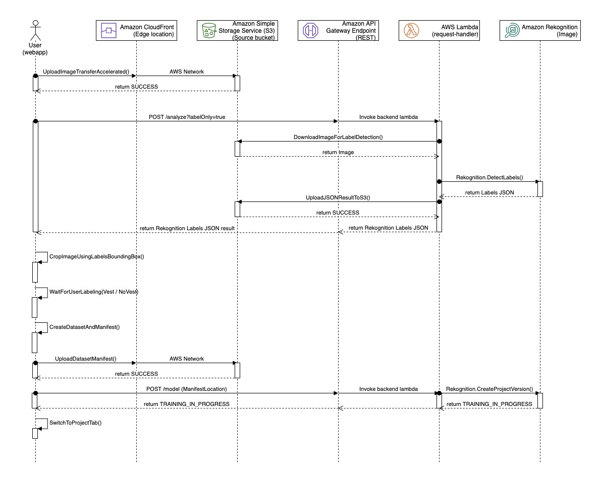
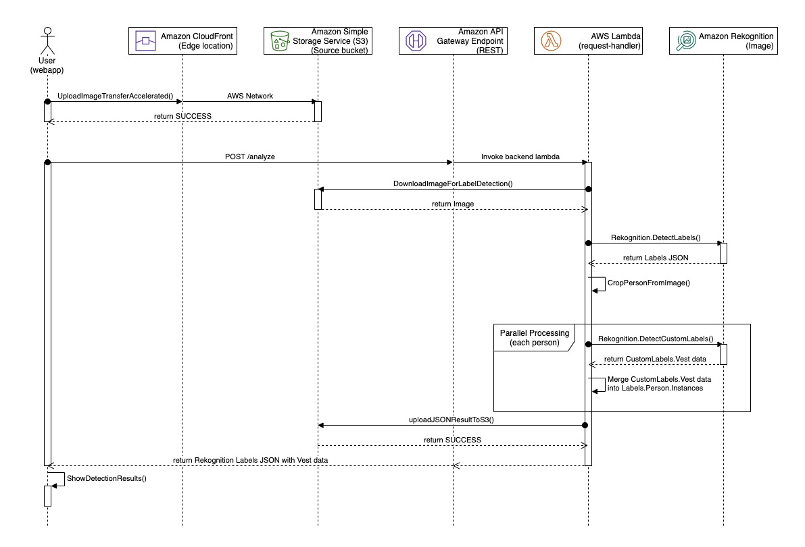

# RESTful API, Training and Analysis Component

The core implementation of the Training and Analysis workflows resides in a lambda function which can be accessed through Amazon API Gateway endpoint. Each HTTP incoming request is authenicated with AWS_IAM.

The following sections describe:
* The RESTful API endpoints
* Training and Analysis Call Flows
* and IAM role policy and permission

__

## Amazon API Gateway RESTful endpoint
The RESTful endpoint exposes the following operations.

| Purpose | Name | Method | Query | Body |
|:--------|:-----|:-------|:------|:-----|
| Get available datasets | /\<stage\>/datasets | GET | -- | -- |
| Get a list of Project Versions (models) | /\<stage\>/models | GET | arn=\<project-arn\> | -- |
| Create, start and stop a Project Version (model) | /\<stage\>/model | POST | -- | see details |
| Analyze image(s) with the Custom Labels model | /\<stage\>/analyze | POST | -- | see details |
| Run label detecion only | /\<stage\>/analyze | POST | labelOnly=true | see details |


where **\<stage\>** is a named reference to an [Amazon API Gateway](https://docs.aws.amazon.com/apigateway/latest/developerguide/set-up-stages.html) deployment created by the solution.

__

### Get a list of Project Versions (models) Status

**API**

```
/<stage>/models?arn=arn:aws:rekognition:<region>:<account>:project/ml9800-<guid>-custom-ppe-detection/<datetime>
```


**Method**

```
GET
```

**Request**

The request is sent to the lambda function where it calls [Amazon Rekognition DescribeProjectVersions](https://docs.aws.amazon.com/rekognition/latest/dg/API_DescribeProjectVersions.html#API_DescribeProjectVersions_RequestParameters) API.

**Query parameter**

| Key | Value | Mandatory | Description |
|:--- |:------|:----------|:------------|
| arn | arn string | required | Project Arn created by the CFN stack |
| modelVersion | model version string | optional | provides the specific Project Version (model) Name to get a specific Project Version (model) status |

For example,

```
/<stage>/models?modelVersion=20200523T093230113Z&arn=arn:aws:rekognition:<region>:<account>:project/ml9800-<guid>-custom-ppe-detection/<datetime>
```

**Response**

The response is list of ProjectVersionDescriptions returned from [Amazon Rekognition DescribeProjectVersions](https://docs.aws.amazon.com/rekognition/latest/dg/API_DescribeProjectVersions.html#API_DescribeProjectVersions_ResponseElements) API containing detail information of each project version.

```json
[
  {
    "ProjectVersionArn": "arn:aws:rekognition:<region>:<account>:project/ml9800-<guid>-custom-ppe-detection/version/<version>/1590238598423",
    "CreationTimestamp": "2020-05-23T12:56:38.423Z",
    "Status": "TRAINING_IN_PROGRESS",
    "StatusMessage": "The model is being trained.",
    "OutputConfig": {
      "S3Bucket": "ml9800-<guid>-<account>-<region>-source",
      "S3KeyPrefix": "evaluation/ml9800-<guid>-custom-ppe-detection/<datetime>/manifests/output"
    },
    "TrainingDataResult": {
      "Input": {
        "Assets": [
          {
            "GroundTruthManifest": {
              "S3Object": {
                "Bucket": "ml9800-<guid>-<account>-<region>-source",
                "Name": "datasets/ml9800-<guid>-custom-ppe-detection/<datetime>/manifests/output/output.manifest"
              }
            }
          }
        ]
      }
    },
    "TestingDataResult": {
      "Input": {
        "Assets": [],
        "AutoCreate": true
      }
    }
  }
]

```

__

### Create a Project Version (model)

**API**

```
/<stage>/model
```

**Method**

```
POST
```

**Request**

The request is sent to the lambda function where it calls [Amazon Rekognition CreateProjectVersion](https://docs.aws.amazon.com/rekognition/latest/dg/API_CreateProjectVersion.html) API.

```json
{
  "arn": "arn:aws:rekognition:<region>:<account>:project/ml9800-<guid>-custom-ppe-detection/<datetime>",
  "action": "create",
  "training": {
    "bucket": "ml9800-<guid>-<account>-<region>-source",
    "key": "datasets/ml9800-<guid>-custom-ppe-detection/<datetime>/manifests/output/output.manifest"
  },
  "testing": {
    "autoCreate": true
  }
}

```

where

| Key | Value | Mandatory | Description |
|:--- |:------|:----------|:------------|
| arn | arn string | required | [AWS Rekognition Custom Labels Project Arn](https://docs.aws.amazon.com/rekognition/latest/dg/API_DescribeProjects.html) that describes the project created by the CFN stack |
| action | create | required | specify the request is to create a new Project Version (model) |
| training.bucket | bucket name | required | specify the bucket name where the training dataset is stored |
| training.key | key name | required | specify the key name where the training dataset is stored. The manifest file is created using Image-Level classification, check out the [image-level manifest](https://docs.aws.amazon.com/rekognition/latest/customlabels-dg/cd-manifest-files-classification.html) construct |
| testing.autoCreate | true | required | split 20% of the training dataset for testing |

**Response**

The response returns directly from [Amazon Rekognition CreateProjectVersion](https://docs.aws.amazon.com/rekognition/latest/dg/API_CreateProjectVersion.html) API.

```json
{
  "ProjectVersionArn": "arn:aws:rekognition:<region>:<account>:project/ml9800-<guid>-custom-ppe-detection/version/<datetime>/<guid>"
}
```

__

### Start a specific Project Version (model)

**API**

```
/<stage>/model
```

**Method**

```
POST
```

**Request**

The request is sent to the lambda function where it calls [Amazon Rekognition StartProjectVersion](https://docs.aws.amazon.com/rekognition/latest/dg/API_StartProjectVersion.html) API.


```json
{
  "action": "start",
  "arn": "arn:aws:rekognition:<region>:<account>:project/ml9800-<guid>-custom-ppe-detection/version/<datetime>/<guid>",
  "inference": 1
}

```

where

| Key | Value | Mandatory | Description |
|:--- |:------|:----------|:------------|
| arn | arn string | required | [AWS Rekognition Custom Labels Project Version Arn](https://docs.aws.amazon.com/rekognition/latest/dg/API_StartProjectVersion.html#API_StartProjectVersion_RequestParameters) that describes the project version (model) |
| action | start | required | specify to start a project version (model) |
| inference | 1 | optional | specify how many inferences to create, default to 1 |

**Response**

The response returns directly from [Amazon Rekognition StartProjectVersion](https://docs.aws.amazon.com/rekognition/latest/dg/API_StartProjectVersion.html#API_StartProjectVersion_ResponseElements) API indicating the project version status.

```json
{
  "Status": "TRAINING_IN_PROGRESS"
}
```

__

### Stop a specific Project Version (model)

**API**

```
/<stage>/model
```

**Method**

```
POST
```

**Request**

The request is sent to the lambda function where it calls [Amazon Rekognition StopProjectVersion](https://docs.aws.amazon.com/rekognition/latest/dg/API_StopProjectVersion.html) API.


```json
{
  "action": "stop",
  "arn": "arn:aws:rekognition:<region>:<account>:project/ml9800-<guid>-custom-ppe-detection/version/<datetime>/<guid>",
}

```

where

| Key | Value | Mandatory | Description |
|:--- |:------|:----------|:------------|
| arn | arn string | required | [AWS Rekognition Custom Labels Project Version Arn](https://docs.aws.amazon.com/rekognition/latest/dg/API_StopProjectVersion.html#API_StopProjectVersion_RequestParameters) that describes the project version (model) |
| action | stop | required | indicate to stop a project version (model) |

**Response**

The response returns directly from [Amazon Rekognition StopProjectVersion](https://docs.aws.amazon.com/rekognition/latest/dg/API_StopProjectVersion.html#API_StopProjectVersion_ResponseElements) API indicating the project version status.

```json
{
  "Status": "STOPPING"
}
```

__

### Analyze image(s) with Custom Labels model

**API**

```
/analyze
```

**Method**

```
POST
```

**Request**

The request is sent to the lambda function where it calls [Amazon Rekognition DetectLabels](https://docs.aws.amazon.com/rekognition/latest/dg/API_DetectLabels.html) API.

```json
{
  "bucket": "ml9800-<guid>-<account>-<region>-source",
  "key": "file-75458384/photo-4429302.jpeg"
}
```

**Response**

The response contains the JSON result similar to [Amazon Rekognition DetectLabels](https://docs.aws.amazon.com/rekognition/latest/dg/API_DetectLabels.html#API_DetectLabels_ResponseElements) API. The only difference is the additional **HasVest** data structure that indicates the vest detection result with a confidence score, see sample JSON response below.


```json
{
  "Labels": [
    ...
    {
      "Name": "Person",
      "Confidence": 99.65798950195312,
      "Instances": [
        {
          "BoundingBox": {
            "Width": 0.3316318094730377,
            "Height": 0.8394125699996948,
            "Left": 0.24740633368492126,
            "Top": 0.14787791669368744
          },
          "Confidence": 99.65798950195312,
          "HasVest": {
            "Value": true,
            "Confidence": 71.14400482177734
          }
        },
        ...
      ],
      "Parents": []
    },
  ],
}

```

__

### Run Label Detection only
This is used for preparing the training dataset where you upload an image with multiple people and use the Amazon Rekognition Label Detection to get bounding boxes of each person within an image.

**API**

```
/analyze?labelOnly=true
```

_(where labelOnly query parameter tells the lambda function to skip Custom Labels detection.)_

**Method**

```
POST
```

**Request**

The request is sent to the lambda function where it calls [Amazon Rekognition DetectLabels](https://docs.aws.amazon.com/rekognition/latest/dg/API_DetectLabels.html) API.

```json
{
  "bucket": "ml9800-<guid>-<account>-<region>-source",
  "key": "file-75458384/photo-4429302.jpeg"
}
```

**Response**

The response is returned directly from [Amazon Rekognition DetectLabels](https://docs.aws.amazon.com/rekognition/latest/dg/API_DetectLabels.html#API_DetectLabels_ResponseElements) API.


```json
{
  "FaceDetails": [
    {
      "BoundingBox": {
        "Width": 0.15400327742099762,
        "Height": 0.13535557687282562,
        "Left": 0.49517562985420227,
        "Top": 0.4192347228527069
      },
      "Confidence": 99.99996185302734,
      ...
    },
    ...
  ]
}

```

___

## Training Workflow

### Call Flow



* Web application uploads image(s) to source S3 bucket. (_Note: [Amazon S3 Transfer Accelection](https://docs.aws.amazon.com/AmazonS3/latest/dev/transfer-acceleration.html) is used to reduce the upload time by taking advantage of the global Amazon CloudFront edge locations)
* Send a POST /analyze request, specified labelOnly=true query parameter to indicate using Rekognition.DetectLabels API only
* Using the BoundingBoxes information to crop all people from the images, to label each person with **vest** and **novest** through the web UI
* Create an [Image-Level Labels Manifest](https://docs.aws.amazon.com/rekognition/latest/customlabels-dg/cd-manifest-files-classification.html) file and upload the file and the training datasets to source bucket
* Web application POST /model request to create a training model where the lambda function calls Rekognition.CreateProjectVersion API
* return TRAINING_IN_PROGRESS status if the request is succeeded

When the trainning is started, navigate to **Project** tab from the web user interface to start, stop, and monitor the status of the model. _(Note: the web application polls the model status every 10 minutes.)_

___

## Analysis Workflow

### Call Flow



* Web application uploads image(s) to source S3 bucket
* Send a POST /analys request without any query parameter
* Lambda function starts the analysis process
  * First downloads the image from source S3 bucket
  * Calls Rekognition.DetectLabels API to obtain BoundingBox information of the image
  * Crop all people from the image
  * Parallelly process each person within an image
    * Calls Rekognition.DetectCustomLabels API to obtain CustomLabels.HasVest result
    * Merge result to Person.Instances data structure (obtained from DetectLabels)
  * return **modified** Person.Instances data structure with HasVest detection result
* Web application receives BoundingBox information along with the HasVest detection result and shows results on screen

**Important:** When you are done with the analysis, make sure to **stop** the model as there is a cost to keep the model running, [Inference Hours](https://aws.amazon.com/rekognition/pricing/#Amazon_Rekognition_Custom_Labels_pricing)

___

## Navigating File Structure in Amazon S3 Source Bucket

The images and JSON (detection) results are stored in your Amazon S3 source bucket created by the CloudFormation stack.

| Stage | Location | Description |
|:-----|:-----|:---------|
| preparation | /prepare-data/\<date\>/ | stores original images that are used for preparing the training dataset and Amazon Rekognition DetectLabels JSON result |
| training dataset | /training-data/ml9800-\<guid\>-custom-ppe-detection/\<date\>/**\<label\>/** | stores the labeled (preprocessed) images  in the categoried path (\<label\>). In this demo, you should find **vest** and **novest** categories |
| training dataset manifest | /datasets/ml9800-\<guid\>-custom-ppe-detection/\<date\>/manifests/ | stores the training dataset manifest file used by Amazon Rekognition Custom Labels to train a model. (The manifest file describes source references of all training images.) |
| model evaluation | /evaluation/ml9800-\<guid\>-custom-ppe-detection/\<date\>/manifests/ | stores detail information of the evaluation of your trained model |
| analysis result | /analyzed-data/\<date\>/ | stores images that you have requested for analysis and the JSON results of the detections (combined JSON results with Amazon Rekognition DetectLabels and DetectCustomLabels) |


___

## Security

HTTPS request is authenticated with a valid AWS crendential. Upon sign in to the web portal, Amazon Cognito issues a temporary AWS security credential to the authenticated user to access limited AWS resources.

### IAM Role given to an Authenticated Amazon Cognito User
The authenicated user is given access to **invoke** the RESTful API endpoint and GetObject and PutObject to the **source** S3 bucket.

```json
{
    "Version": "2012-10-17",
    "Statement": [
        {
            "Action": "cognito-identity:GetId",
            "Resource": "arn:aws:cognito-identity:<region>:<account>:identitypool/<region>:<guid>",
            "Effect": "Allow"
        },
        {
            "Action": "execute-api:Invoke",
            "Resource": "arn:aws:execute-api:<region>:<account>:<api-id>/*/*/*",
            "Effect": "Allow"
        },
        {
            "Action": [
                "s3:GetObject",
                "s3:PutObject",
                "s3:ListBucket"
            ],
            "Resource": [
                "arn:aws:s3:::ml9800-<guid>-<account>-<region>-source",
                "arn:aws:s3:::ml9800-<guid>-<account>-<region>-source/*"
            ],
            "Effect": "Allow"
        }
    ]
}

```
__

### IAM Role used by the API backend Lambda Function
The lambda function that processes the training and analysis workflows is given the following permission to access specific resources such as Amazon S3 bucket and Amazon Rekognition services.

```json
{
    "Version": "2012-10-17",
    "Statement": [
        {
            "Action": [
                "logs:CreateLogGroup",
                "logs:CreateLogStream",
                "logs:PutLogEvents"
            ],
            "Resource": "arn:aws:logs:<region>:<account>:log-group:/aws/lambda/*",
            "Effect": "Allow"
        },
        {
            "Action": "s3:ListAllMyBuckets",
            "Resource": "arn:aws:s3:::*",
            "Effect": "Allow"
        },
        {
            "Action": "s3:ListBucket",
            "Resource": "arn:aws:s3:::ml9800-<guid>-<account>-<region>-source",
            "Effect": "Allow"
        },
        {
            "Action": [
                "s3:GetObject",
                "s3:GetObjectAcl",
                "s3:GetObjectVersion",
                "s3:GetObjectTagging",
                "s3:PutObject"
            ],
            "Resource": "arn:aws:s3:::ml9800-<guid>-<account>-<region>-source/*",
            "Effect": "Allow"
        },
        {
            "Action": "rekognition:DetectLabels",
            "Resource": "*",
            "Effect": "Allow"
        },
        {
            "Action": "rekognition:DetectCustomLabels",
            "Resource": "arn:aws:rekognition:<region>:<account>:project/ml9800-<guid>-custom-ppe-detection/version/*/*",
            "Effect": "Allow"
        },
        {
            "Action": "rekognition:CreateProjectVersion",
            "Resource": [
                "arn:aws:rekognition:<region>:<account>:project/ml9800-<guid>-custom-ppe-detection/*",
                "arn:aws:rekognition:<region>:<account>:project/ml9800-<guid>-custom-ppe-detection/version/*/*"
            ],
            "Effect": "Allow"
        },
        {
            "Action": "rekognition:DescribeProjects",
            "Resource": "*",
            "Effect": "Allow"
        },
        {
            "Action": "rekognition:DescribeProjectVersions",
            "Resource": "arn:aws:rekognition:<region>:<account>:project/ml9800-<guid>-custom-ppe-detection/*",
            "Effect": "Allow"
        },
        {
            "Action": [
                "rekognition:StartProjectVersion",
                "rekognition:StopProjectVersion"
            ],
            "Resource": "arn:aws:rekognition:<region>:<account>:project/ml9800-<guid>-custom-ppe-detection/version/*/*",
            "Effect": "Allow"
        }
    ]
}

```

___

Next to [Webapp component](../webapp/README.md) | Return to [README](../../README.md)

